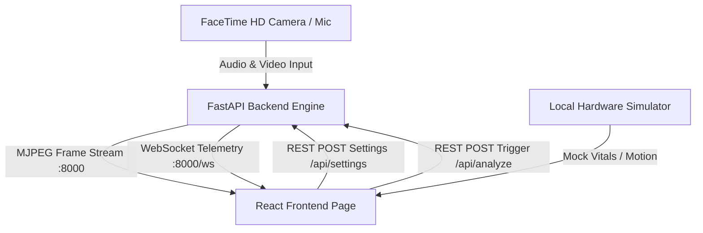

# 👶 Smart Nursery Monitor — Premium IoT Suite (v2.0 PRO)

A state-of-the-art, real-time baby monitoring dashboard combining a high-performance **Python FastAPI backend** for computer vision and audio classification with a **React (Vite/TanStack Start) frontend** styled in premium glassmorphism.

---

## 📸 Dashboard Preview

Here is a preview of the smart baby monitor dashboard interface in action:

```
┌────────────────────────────────────────────────────────────────────────┐
│  👶 Nursery Monitor  [v2.0 PRO]                     ● Connected        │
├────────────────────────────────────────────────────────────────────────┤
│ 🌡️ 22.4°C         💧 48%            🌙 Light Sleep      ❤️ 82 BPM       │
│ Ideal Room Temp    Ideal Humidity    Normal Cycle       Resting Vitals  │
├───────────────────────────────────────┬────────────────────────────────┤
│                                       │                                │
│   [ FEED://CAM-01 ]         ● LIVE    │   🎙️ Sound Detection Engine    │
│                                       │   ┌────────────────────────┐   │
│                                       │   │ ~~~~ Siri Wave ~~~~    │   │
│                                       │   └────────────────────────┘   │
│                                       │          (●) Listen            │
│   [Normal] [Night Vision] [Blueprint] │   Status: Baby Calm / Sleep    │
├───────────────────────────────────────┼────────────────────────────────┤
│  📈 Motion Analysis Log                │   ⚙️ Controls & Configuration   │
│  4000 ─────────────────────────────── │   Video Sensitivity Buffer [═] │
│  2000 ─ ─ ─ ─ ─ ─ ─ (Limit Line)      │   Audio Feature Threshold  [═] │
│     0 ──/\_/\_/\_____________________ │   [x] Native system alerts     │
└───────────────────────────────────────┴────────────────────────────────┘
```

> **Add Your Screenshots Here:**
> 
> *Main Glassmorphic Dashboard View:*
> 
> 
> *Active Cry Distress Alert Overlay:*
> 
> 
> *Night Vision Camera View & HUD:*
> 

---

## ⚙️ Features

### 1. Dynamic Camera Stream & HUD HUD Filter Overlay
* **Multi-thread Safe Video Loop**: Solves OpenCV AVFoundation concurrency conflicts (`SIGTRAP` Trace traps) on macOS using a dedicated singleton reader thread.
* **Main Thread macOS Compliance**: Autodetects and initializes camera bounds on the main loop thread to bypass Mac app sandbox blocks.
* **Sci-Fi HUD Overlays**: Displays active framerate (FPS), camera index, and resolution metrics.
* **Instant Filters**: Switch live feeds between **Normal**, green scanline **Night Vision**, and contrast **Blueprint** modes in real-time.

### 2. Clinical Baby Vitals & SVG Sparkline Graphs
* **Pediatric Status Badges**: Evaluates nursery temperature and humidity against clinical standards (warning against cold or SIDS overheating risks).
* **Vitals Trend Lines**: Draws lightweight, real-time SVG sparklines next to vital values showing the last 1 minute of fluctuations.
* **Interactive Guidance Drawer**: Click on any vital card (e.g. Heart Rate) to open a detailed guidance pane explaining its clinical meaning.

### 3. Sound Analysis & Siri-Style Visualizer
* **Machine Learning Cry Classifier**: Hooks into a Random Forest classifier (`model_rf.pkl`) for active baby crying detection.
* **Responsive Waveform Visualizer**: Animates a Siri-like layered canvas sine wave with frequency feedback when recording.

### 4. Dynamic Dotted Calibration Bounds
* Adjust the **Video sensitivity buffer** slider to watch the graph's yellow and red limit boundaries shift up and down in real-time.
* Fully functional **Native Alerts** system hooks into macOS notification center (`osascript`).

### 5. Local Hardware Simulation Sandbox
* Turn on the **Hardware Simulator** toggle to test features without camera or microphone access. Includes one-click presets for **Sleep**, **Waking**, and **Crying** states to mock all vitals and graphs.

---

## 🛠️ System Architecture



---

## 📥 Installation & Setup

### Prerequisites
* **Python 3.10+**
* **Node.js 18+** & **Bun** (or `npm`)

### 1. Setup the Python Backend
```bash
# Navigate to backend
cd backend

# Install dependencies
pip install fastapi uvicorn websockets opencv-python numpy scikit-learn joblib librosa sounddevice soundfile

# Run backend (Must run in your own macOS Terminal to grant camera permissions)
uvicorn main:app --host 0.0.0.0 --port 8000 --reload
```

### 2. Setup the React Frontend
```bash
# Navigate to frontend
cd ../frontend

# Install dependencies
bun install   # or npm install

# Start Vite dev server
bun run dev   # or npm run dev
```

Visit **[http://localhost:8080](http://localhost:8080)** in your browser.

---

## 📂 Directory Layout

```
baby_monitor/
├── backend/
│   ├── AUDIO_ANALYSIS/      # ML classifier, raw data, and features extractors
│   ├── VIDEO_ANALYSIS/      # OpenCV frame template outputs
│   ├── main.py              # FastAPI server, endpoints, and camera loop
│   └── test_cam.py          # Standalone macOS camera test diagnostic
├── frontend/
│   ├── src/
│   │   ├── components/
│   │   │   ├── monitor/     # QuickStats, LiveVideo, ListenAnalyze widgets
│   │   │   └── ui/          # Radix-ui/shadcn primitives (card, slider, switch)
│   │   ├── routes/
│   │   │   └── index.tsx    # Unified dashboard layout and simulator state
│   │   ├── styles.css       # Core design system tokens and glassmorphism CSS
│   └── vite.config.ts
└── .gitignore               # Excludes virtual environments and node modules
```
